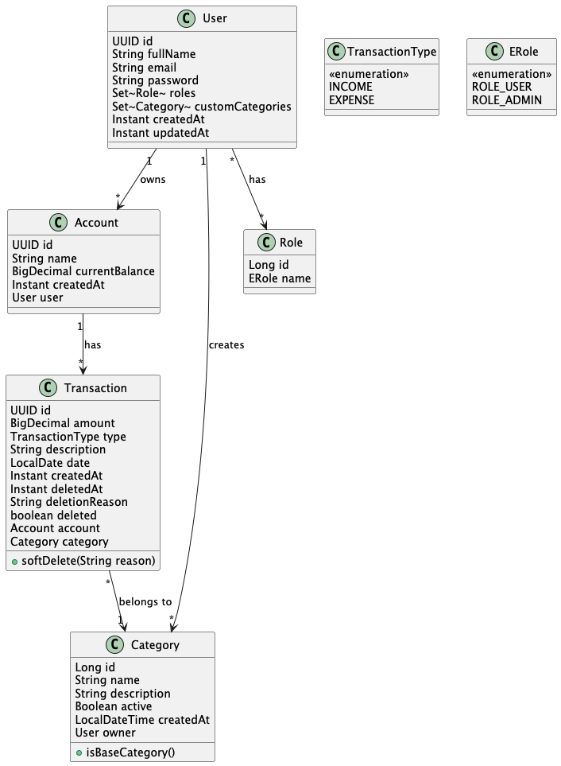

# Minerva Money

Sistema de gerenciamento financeiro pessoal desenvolvido durante o módulo Programação Web II no programa Santander
Coders 2024.1.

## 📋 Sobre

O Minerva Money é uma aplicação de gerenciamento financeiro pessoal que permite aos usuários controlar suas finanças
através do registro de transações, categorização de despesas e receitas, e acompanhamento de saldo. O sistema oferece
recursos como múltiplas contas, categorias personalizáveis e relatórios financeiros.

## 💻 Requisitos

- Java 17 ou superior
- Docker e Docker Compose
- Maven
- Git

## 🛠️ Como Executar

### Windows

1. Clone o repositório:

```powershell
git clone git@github.com:dluks82/coders24-minerva-money.git
cd coders24-minerva-money
```

2. Inicie o banco de dados (requisito para executar a aplicação):

```powershell
docker-compose up -d
```

3. Execute a aplicação:

```powershell
.\mvnw.cmd spring-boot:run
```

### Linux/macOS

1. Clone o repositório:

```bash
git clone git@github.com:dluks82/coders24-minerva-money.git
cd coders24-minerva-money
```

2. Inicie o banco de dados (requisito para executar a aplicação):

```bash
docker compose up -d
```

3. Execute a aplicação:

```bash
./mvnw spring-boot:run
```

### Verificando a Instalação

1. Verifique se o container do PostgreSQL está rodando:

```bash
docker ps
```

2. A aplicação estará disponível em:

```
http://localhost:8081
```

3. Acesse a documentação da API:

```
http://localhost:8081/swagger-ui.html
```

### Resolvendo Problemas Comuns

1. Porta 5433 em uso:

```bash
# Windows (PowerShell)
netstat -ano | findstr :5433
taskkill /PID [PID_NUMBER] /F

# Linux/macOS
lsof -i :5433
kill -9 [PID_NUMBER]
```

2. Limpando containers e volumes Docker:

```bash
docker compose down -v
```

3. Verificando logs:

```bash
docker compose logs postgres
```

## 🚀 Tecnologias

- Java 17
- Spring Boot 3.3.5
    - Spring Data JPA
    - Spring Security
    - Spring Validation
    - Spring Web
- PostgreSQL 16
- Flyway
- JWT (JSON Web Token)
- Lombok
- MapStruct
- ModelMapper
- SpringDoc OpenAPI

## 🏗️ Arquitetura

### Diagrama de Classes



O diagrama de classes em formato PlantUML está disponível em `diagrams/class-diagram.puml`.

### Modelo de Domínio

- **User**: Usuário do sistema
    - Possui múltiplas contas
    - Pode criar categorias personalizadas
    - Tem roles associadas (ROLE_USER, ROLE_ADMIN)

- **Account**: Conta financeira
    - Pertence a um usuário
    - Mantém saldo atual
    - Possui múltiplas transações

- **Transaction**: Movimentação financeira
    - Pode ser receita (INCOME) ou despesa (EXPENSE)
    - Pertence a uma conta
    - Associada a uma categoria
    - Suporta exclusão lógica

- **Category**: Categoria de transação
    - Pode ser padrão do sistema ou personalizada
    - Se personalizada, pertence a um usuário específico

[resto do documento permanece igual...]

### Categorias Padrão

- **Receitas**:
    - Salário
    - Investimentos
    - Freelancer
- **Despesas**:
    - Moradia
    - Alimentação
    - Transporte
    - Saúde
    - Educação
    - Lazer
    - Outros

## ⚙️ Regras de Negócio

1. **Contas**
    - Usuário recebe uma conta "default" ao se registrar
    - Saldo é atualizado automaticamente com cada transação
    - Contas podem ter saldo negativo

2. **Categorias**
    - Sistema possui 10 categorias padrão
    - Usuários podem criar categorias personalizadas
    - Categorias podem ser ativadas/desativadas

3. **Transações**
    - Podem ser do tipo receita (INCOME) ou despesa (EXPENSE)
    - Atualizam o saldo da conta automaticamente
    - Suportam exclusão lógica (soft delete)

## 🔄 APIs

### Autenticação

- `POST /auth/signup` - Cadastro de usuário
- `POST /auth/login` - Login de usuário

### Contas

- `GET /accounts` - Listar contas
- `GET /accounts/{accountId}/dashboard` - Visualizar dashboard
- `GET /accounts/{accountId}/balance` - Consultar saldo

### Categorias

- `GET /category` - Listar categorias
- `POST /category` - Criar nova categoria
- `GET /users/categories/custom` - Listar categorias personalizadas
- `GET /users/categories/all` - Listar todas as categorias
- `POST /users/categories/create-custom` - Criar categoria personalizada
- `DELETE /users/categories/delete` - Excluir categoria personalizada

### Transações

- `GET /accounts/{accountId}/transactions` - Listar transações
- `POST /accounts/{accountId}/transactions` - Criar transação
- `POST /accounts/{accountId}/transactions/batch` - Criar múltiplas transações
- `GET /accounts/{accountId}/transactions/{transactionId}` - Buscar transação
- `DELETE /accounts/{accountId}/transactions/{transactionId}` - Excluir transação
- `GET /accounts/{accountId}/transactions/summary` - Obter resumo

### Usuários

- `GET /users/me` - Obter dados do usuário autenticado
- `PATCH /users/{user_id}/role` - Atualizar role do usuário

## 🧑‍💻 Equipe

| [](https://github.com/dluks82) | [](https://github.com/Isaquemz) | [](https://github.com/RAODomingos) | [](https://github.com/squoliver83) |
|:-------------------------------------------------------------------------------------------------------------------:|:----------------------------------------------------------------------------------------------------------------------:|:----------------------------------------------------------------------------------------------------------------------------:|:----------------------------------------------------------------------------------------------------------------------------:|
|                                    [Diogo Oliveira](https://github.com/dluks82)                                     |                                     [Isaque Menezes](https://github.com/Isaquemz)                                      |                                      [Rômulo Domingos](https://github.com/RAODomingos)                                       |                                      [Samuel Quaresma](https://github.com/squoliver83)                                       |

## 💬 Agradecimentos

Gostaríamos de expressar nossa gratidão ao instrutor e colaboradores do **Santander Coders 2024.1**, cujo apoio foi
essencial para a conclusão deste projeto.

## 📄 Licença

Este projeto está sob a licença especificada no arquivo [LICENSE](LICENSE).
